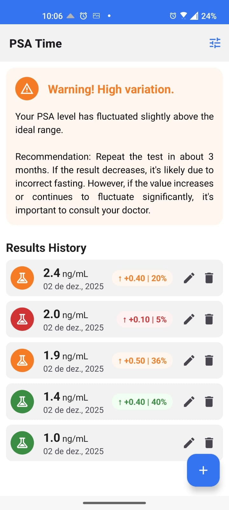
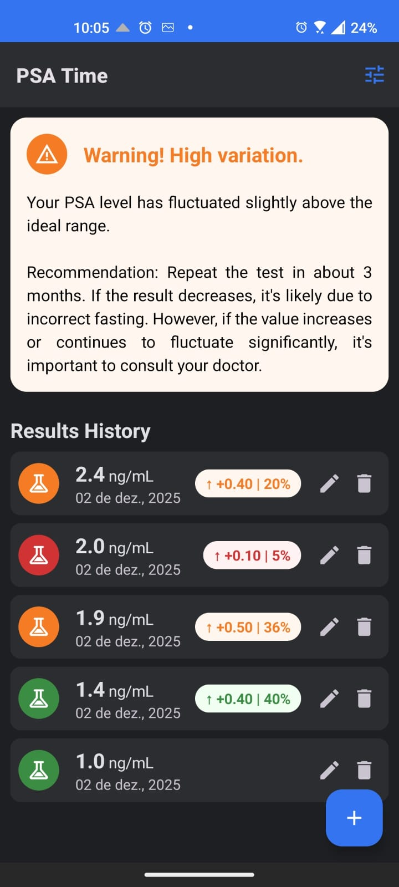
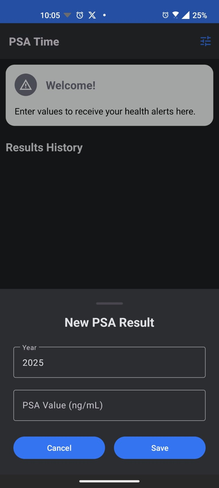
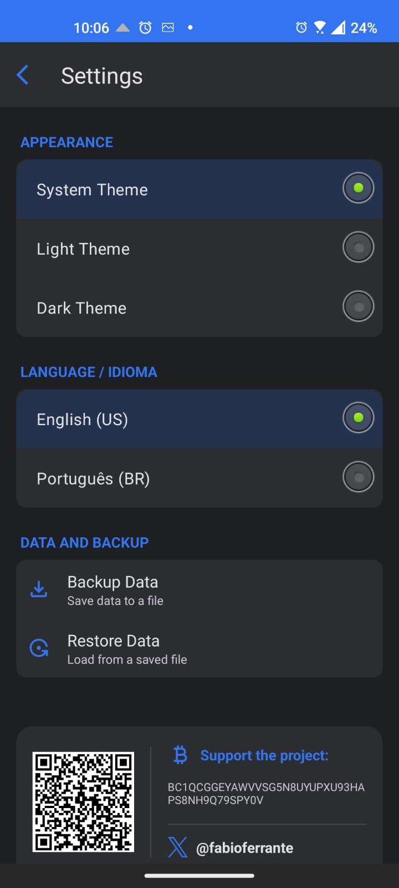

# PSA Time — Prostate Health Tracking App

PSA Time é um aplicativo Android nativo focado na saúde preventiva masculina. Mais do que um simples histórico de exames, ele atua como um assistente inteligente para o monitoramento do PSA (Antígeno Prostático Específico).

O aplicativo implementa algoritmos de lógica clínica para analisar a velocidade de variação (delta) dos níveis de PSA, emitindo alertas proativos (Verde, Amarelo, Vermelho) e agendando notificações inteligentes para garantir que exames de confirmação ou rotina não sejam esquecidos.

Screenshots

      

---

# Sumário

- [Sobre o PSA Time](#sobre-o-psa-time)
- [Aurora-7 Royalty License](#aurora-7-royalty-license)
- [Uso Comercial](#uso-comercial)
- [Royalties (7%)](#royalties-7)
- [Documentação Técnica](#documentação-técnica)
- [Contato Comercial](#contato-comercial)

---

# Sobre o PSA Time

O **PSA Time** organiza e interpreta variações anuais do exame PSA, emitindo alertas visuais simples e diretos que ajudam no acompanhamento precoce de alterações significativas.

Este repositório inclui:

- Documentação técnica
- Documentação legal
- Contrato comercial
- Badges e artes do projeto

---

# Aurora-7 Royalty License

Este projeto é licenciado sob a **Aurora-7 Royalty License**, um modelo híbrido:

**Uso pessoal, educacional e open-source: GRATUITO**
**Uso comercial: exige licença + taxa fixa + royalties**
**Royalties: 7% (lucro ou faturamento, conforme especificado)**
**Pagamento via Bitcoin (Lightning ou Mainnet)**

Licenças completas:
- **English License** → [`LICENSE.md`](./LICENSE.md)
- **Português BR** → [`LICENSE-PTBR.md`](./LICENSE-PTBR.md)

---

# Uso Comercial

Para uso comercial (empresas, produtos pagos, SaaS etc.):

1. Adquirir a **Licença Comercial Aurora-7**  
2. Efetuar o pagamento da taxa fixa de **$100 em BTC**  
3. Enviar comprovante conforme o guia  
4. Registrar o projeto licenciado  
5. Passar a reportar royalties trimestrais

Guia completo:

Uso comercial: [`commercial-usage.md`](./docs/usage/commercial-usage.md)  
Contrato completo em PDF → [`commercial-contract-full.pdf`](./docs/legal/commercial-contract-full.pdf)

**Endereços para pagamento:**

**Lightning (LNURL):**  
`initialeffect87@walletofsatoshi.com`  
`lnurl1dp68gurn8ghj7ampd3kx2ar0veekzar0wd5xjtnrdakj7tnhv4kxctttdehhwm30d3h82unvwqhkjmnfw35kzmr9venx2cm58qmsn3gyfx`

** ₿ Bitcoin Mainnet:**  
`BC1QCGGEYAWVVSG5N8UYUPXU93HAPS8NH9Q79SPY0V`

---

# Royalties (7%)

O uso comercial requer pagamento de **7%** sobre **lucro ou faturamento**, conforme acordado.

Guia detalhado: [`royalty-guidelines.md`](./docs/legal/royalty-guidelines.md)

Inclui:
- Como calcular  
- Como reportar  
- Periodicidade   
- Obrigações e prazos  

---

# Documentação Técnica

Toda documentação técnica está em:

`docs/`

---

# Contato Comercial

- X: [@fabioferrante](https://x.com/fabioferrante)
- WhatsApp: [Fabio](https://wa.me/c/554488040274)
- Telegram: [@fabioferrante](https://t.me/fabioferrante)

