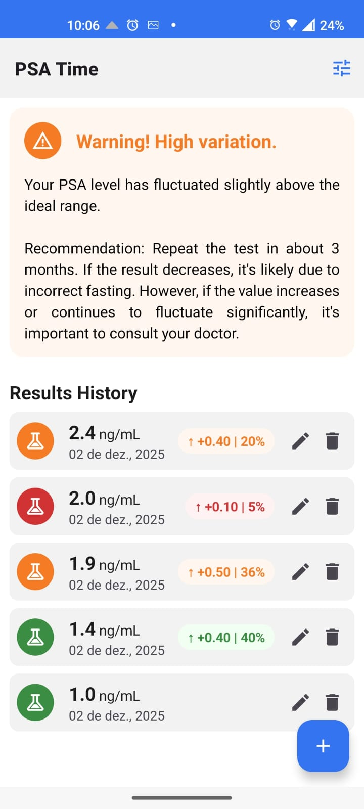
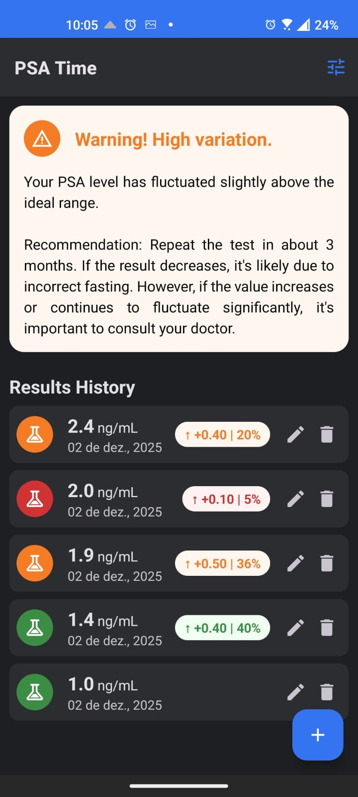
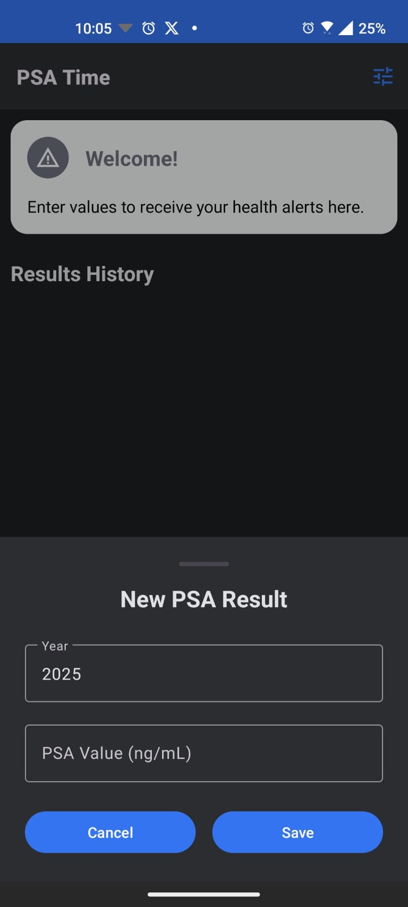
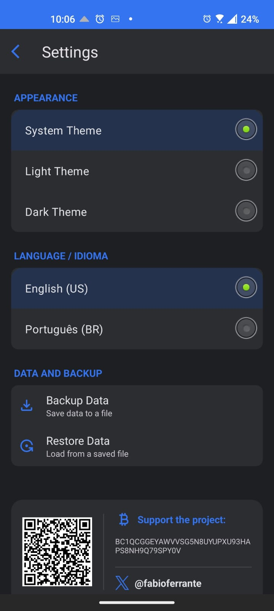

# PSA Time — Prostate Health Tracking App


---

# Sumário

- [Sobre o PSA Time](#sobre-o-psa-time)
- [Aurora-7 Royalty License](#aurora-7-royalty-license)
- [Uso Comercial](#uso-comercial)
- [Royalties (7%)](#royalties-7)
- [Documentação Técnica](#documentação-técnica)
- [Contato Comercial](#contato-comercial)

---

# Sobre o PSA Time

PSA Time é um aplicativo Android nativo focado na saúde preventiva masculina. Mais do que um simples histórico de exames, ele atua como um assistente inteligente para o monitoramento do PSA (Antígeno Prostático Específico).

O aplicativo implementa algoritmos de lógica clínica para analisar a velocidade de variação (delta) dos níveis de PSA, emitindo alertas proativos (Verde, Amarelo, Vermelho) e agendando notificações inteligentes para garantir que exames de confirmação ou rotina não sejam esquecidos.

Screenshots

      


## Funcionalidades Principais

### Inteligência Clínica (Algoritmo de Risco)

O app analisa automaticamente os dados inseridos para classificar o risco:

* **🟢 Nível Normal:**
  Variação anual < **0.4 ng/mL** e valores absolutos dentro da normalidade.

* **🟡 Atenção (Alerta Amarelo):**
  Variação anual ≥ **0.4 ng/mL** **ou** valor inicial > **4.0 ng/mL**.
  ➤ Recomenda reteste em **3 meses**.

* **🔴 Ação Imediata (Alerta Vermelho):**

  * **Crítico Inicial:** Primeiro exame já inserido com valor > **10 ng/mL**.
  * **Confirmação de Risco:** Lógica de 3 pontos que detecta aumento sustentado em curto intervalo (reteste positivo).


### Sistema de Notificações Proativo

Utilizando **AlarmManager** e **BroadcastReceiver**, o app lembra o usuário de momentos importantes:

* **Novembro Azul:** Lembrete anual fixo em **1º de Novembro**.
* **Follow-up Anual:** Notificação dinâmica **1 ano após** o último exame.
* **Cobrança de Confirmação:**
  Quando ocorre um **Alerta Amarelo**, o app agenda um lembrete automático para **3 meses depois**
  (cancelado automaticamente se o novo exame for registrado antes).


### Segurança e Privacidade

* **100% Offline:** Todos os dados ficam armazenados localmente via **Room/SQLite**.
* **Backup & Restore:** Exportação/importação em **JSON** via Storage Access Framework.
* **Termos de Uso:** Tela inicial obrigatória garantindo consentimento informado.


### Stack Tecnológico

Projeto desenvolvido seguindo o **Modern Android Development (MAD)**:

* **Linguagem:** Kotlin
* **Arquitetura:** MVVM
* **Persistência:** Room Database
* **UI:** XML + Material Design 3 (M3)
* **Temas:** Suporte Light/Dark com paleta customizada estilo *New UI*
* **Navegação:** Jetpack Navigation Component
* **Assincronismo:** Coroutines & Flow
* **Internacionalização (i18n):** Português (BR) e Inglês (US)


### 📁 Estrutura do Projeto

```
com.fabio.psatime
├── data            # Entidades do Room (PsaResult) e DAOs
├── receiver        # Alarmes e Notificações (BroadcastReceivers)
├── ui
│   ├── addedit     # BottomSheet para inserir/editar dados
│   ├── dashboard   # Tela principal, Adapter, ViewModel
│   └── settings    # Configurações, backup e temas
├── MainActivity.kt # Ponto de entrada
└── TermsActivity.kt# Tela de Termos de Uso
```


## Como Executar

Clone o repositório:

```bash
git clone https://github.com/fabioferrante/PSATime.git
```

Abra no **Android Studio**, aguarde a sincronização do Gradle e execute em um emulador ou dispositivo físico.
**Min SDK:** 26 (Android 8.0).


## Contribuição

1. Faça um **Fork**
2. Crie uma branch:

```bash
git checkout -b feature/NovaFeature
```

3. Commit:

```bash
git commit -m "Adicionando nova feature"
```

4. Push:

```bash
git push origin feature/NovaFeature
```

5. Abra um **Pull Request**


## Apoie o Projeto

Se este projeto te ajudou, considere apoiar o desenvolvimento:


**Lightning (LNURL):**  
`seedz@bipa.app`  

** ₿ Bitcoin Mainnet:**  
`BC1QCGGEYAWVVSG5N8UYUPXU93HAPS8NH9Q79SPY0V`


## Licença

Este projeto está licenciado sob **Aurora-7 Royalty License**. Veja o arquivo **LICENSE** para mais detalhes.


---

# Aurora-7 Royalty License

Este projeto é licenciado sob a **Aurora-7 Royalty License**, um modelo híbrido:

**Uso pessoal, educacional e open-source: GRATUITO**
**Uso comercial: exige licença + taxa fixa + royalties**
**Royalties: 7% (lucro ou faturamento, conforme especificado)**
**Pagamento via Bitcoin (Lightning ou Mainnet)**

Licenças completas:
- **English License** → [`LICENSE.md`](./LICENSE.md)
- **Português BR** → [`LICENSE-PTBR.md`](./LICENSE-PTBR.md)

---

# Uso Comercial

Para uso comercial (empresas, produtos pagos, SaaS etc.):

1. Adquirir a **Licença Comercial Aurora-7**  
2. Efetuar o pagamento da taxa fixa de **$100 em BTC**  
3. Enviar comprovante conforme o guia  
4. Registrar o projeto licenciado  
5. Passar a reportar royalties trimestrais

Guia completo:

Uso comercial: [`commercial-usage.md`](./docs/usage/commercial-usage.md)  
Contrato completo em PDF → [`commercial-contract-full.pdf`](./docs/legal/commercial-contract-full.pdf)

**Endereços para pagamento:**

**Lightning (LNURL):**  
`seedz@bipa.app`  

** ₿ Bitcoin Mainnet:**  
`BC1QCGGEYAWVVSG5N8UYUPXU93HAPS8NH9Q79SPY0V`

---

# Royalties (7%)

O uso comercial requer pagamento de **7%** sobre **lucro ou faturamento**, conforme acordado.

Guia detalhado: [`royalty-guidelines.md`](./docs/legal/royalty-guidelines.md)

Inclui:
- Como calcular  
- Como reportar  
- Periodicidade   
- Obrigações e prazos  

---

# Documentação Técnica

Toda documentação técnica está em:

`docs/`

---

# Contato Comercial

- X: [@fabioferrante](https://x.com/fabioferrante)
- WhatsApp: [Fabio](https://wa.me/c/554488040274)
- Telegram: [@fabioferrante](https://t.me/fabioferrante)


